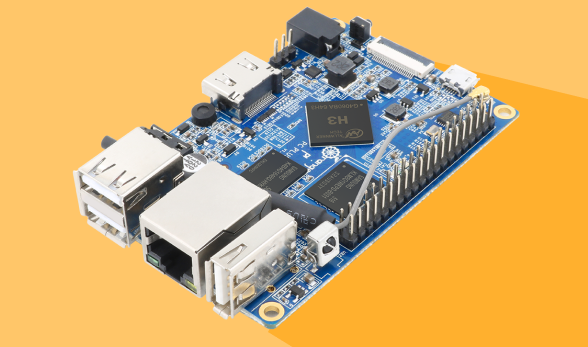
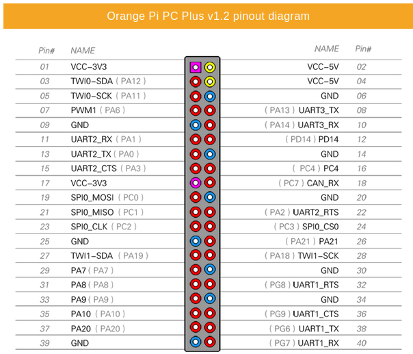
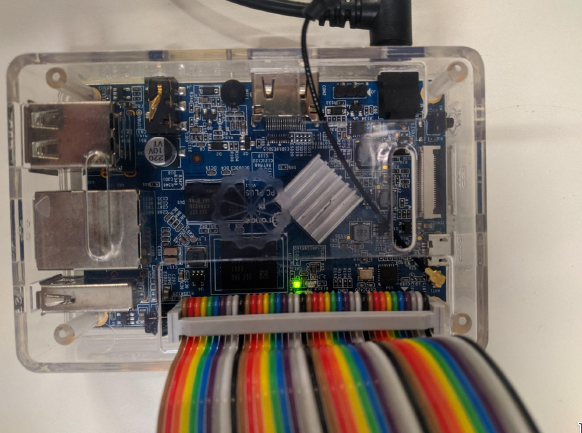
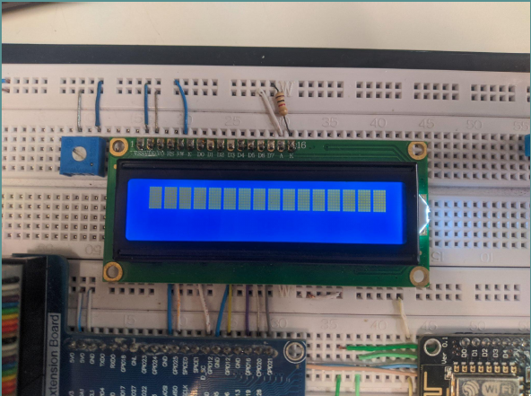
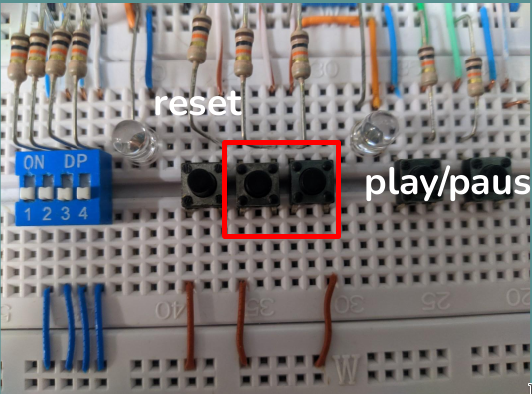

<a id="top"></a>
# TIMER ASSEMBLY

* * *

## Problema I - TEC499 - MI Sistemas Digitais

Professor: Thiago Cerqueira de Jesus

Dupla: Carlos Valadão e Fernando Mota

* * *

## Seções 

&nbsp;&nbsp;&nbsp;[**1.** Introdução](#introducao)

&nbsp;&nbsp;&nbsp;[**2.** Hardware Utilizado](#hardware_utilizado)

&nbsp;&nbsp;&nbsp;[**3.** Softwares Utilizados](#softwares_utilizados)

&nbsp;&nbsp;&nbsp;[**4.** Descrição da Solução](#descricao_solucao)

&nbsp;&nbsp;&nbsp;[**5.** Testes realizados](#testes_realizados)

&nbsp;&nbsp;&nbsp;[**6.** Limitações da solução desenvolvida](#limitacoes)

&nbsp;&nbsp;&nbsp;[**7.** Documentação Utilizada](#documentacao)

&nbsp;&nbsp;&nbsp;[**8.** Execução do Projeto](#execucao_projeto)


<a id="introducao"></a>
## Introdução

Este documento apresenta em detalhes o desenvolvimento de um temporizador escrito apenas utilizando a linguagem assembly da arquitetura ARM V7 e implementado em um single board computer da família Orange PI.

O projeto consiste em um temporizador que exibe o valor contado em um display LCD 16x2 e pode ser pausado e resetado por meio de 2 botões push. Uma vez que o tempo inicial de contagem é definido diretamente no código.
Por meio dos botões é possível:
	- Iniciar contagem;
	- Pausar contagem
	- Retomar Contagem anteriormente pausada
	- Reiniciar contagem para o tempo pré-definido

Visando reutilizar o código aqui desenvolvido para uso futuro, foi cirada uma biblioteca para a linguagem C, a biblioteca possui funções para envio de comandos ao display LCD utilizado na resolução do problema,
separada como uma biblioteca (.o), permite no mínimo as seguinte operações: 
```
1) Limpar display
2) Escrever caractere
3) Posicionar cursor (linha e coluna).
```
Além de:
```
4) Deslocar cursor do display para a direita
5) Ligar display, ativar cursor e fazê-lo piscar
6) Desligar display
7) Return Home
```

* * *
<a id="hardware_utilizado"></a>
## Hardware Utilizado:
O hardware utilizado para a síntese e testes deste projeto é uma Orange PI PC Plus, com 40 pinos GPIO e um processador H3 Quad-core Cortex-A7 H.265/HEVC 4K com arquitetura ARM V7, rodando o sistema operacional Raspbian com Kernel proprietário e em sua versão 5.15.74-sunxi.
## [Orange Pi PC Plus](http://www.orangepi.org/html/hardWare/computerAndMicrocontrollers/details/Orange-Pi-PC-Plus.html)

### Especificações - Orange PI PC Plus:


<!--  -->


| CPU | H3 Quad-core Cortex-A7 H.265/HEVC 4K   |
|:--- |                                   ---: |
| GPU |     Mali400MP2 GPU @600MHz             |
| Memória (SDRAM) |  1GB DDR3 (shared with GPU)|
| Armazenamento interno | Cartão MicroSD (32 GB); 8GB eMMC Flash|
| Rede embarcada | 10/100 Ethernet RJ45        |
| Fonte de alimentação | Entrada DC,<br>entradas USB e OTG não servem como fonte de alimentação | 
| Portas USB | 3 Portas USB 2.0, uma porta OTG USB 2.0 |
| Periféricos de baixo nível | 40 pinos        |

### Pinout Orange PI PC Plus:
Por meio dos pinos de entrada e saída de propósito geral foi possível prosseguir com a solução e
enviar dados e comandos ao display LCD 16x2 e interagir com os botões push, todos os pinos do computador estão dispostos conforme a figura abaixo:


<!--  -->

<a id="softwares_utilizados"></a>
## Softwares utilizados:
Afim de auxiliar durante processo de desenvolvimento do sistema temporizador, foram empregadas diversas ferramentas, sendo elas:

[GNU Make](https://www.gnu.org/software/make/manual/make.html): Uma vez que a SBC é acessada via terminal precisamos compilar o código através de comandos escritos em terminal, ao contrário das facilidades oferecidas por uma IDE, como um simples clique para compilar um código, é nesse sentido que o GNU Make ajuda na etapa de desenvolvimento e testes, essa ferramenta nos permite escrever Makefiles, que são arquivos de texto que possuem regras explícitas a serem executadas sempre que aquela regra for digitada, como um mnemônico ou apelido, ou seja podemos executar vários comandos com uma única regra, ou alias. Em geral, o arquivo executável é gerado a partir dos arquivos objeto, que são gerados pela compilação dos arquivos de origem. Uma vez que o makefile está configurado corretamente, basta executar o comando "make" sempre que houver alterações nos arquivos de origem.

[GNU Binutils](https://www.gnu.org/software/binutils/): Essa é uma coleção de ferramentas para lidar com arquivos binários, que inclui o GNU assembler (as) para montar código assembly e o GNU linker (ld) para combinar arquivos objeto, realocar dados e vincular referências de símbolos, gerando o arquivo executável final.

[GDB](https://www.gnu.org/savannah-checkouts/gnu/gdb/index.html): O GNU Debugger é um depurador de código fonte que vem como padrão em sistemas que usam ferramentas GNU, como sistemas baseados em Unix. Sua função é permitir a análise do comportamento de um programa enquanto ele é executado, ajudando a identificar problemas e erros. É possível utilizá-lo tanto com programas escritos em linguagens de alto nível como C e C++, quanto com programas em código assembly.

[QEMU](https://qemu.org) e [CPUlator](https://cpulator.01xz.net/): Essas são ferramentas de emulação de processadores que permitem a criação de um ambiente virtual para testar o sistema em desenvolvimento. O QEMU é capaz de emular uma máquina completa, enquanto o CPUlator é um emulador online que simula alguns periféricos como leds, botões e dip switches. Ambos foram usados para simular a arquitetura ARM.


<a id="descricao_solucao"><a/>
## Descrição da solução
Para a criação do timer foi utilizada a linguagem assembly e um subconjunto do conjunto de instruções da arquitetura ARM V7, bem como a utilização do editor de texto vim, para a elaboração dos códigos fonte, e para auxílio de debugação fora utilizado a ferramenta GDB. Por sua vez, a síntese do projeto ocorreu em um computador de placa única, Orange PI PC Plus, juntamente com os periféricos conectados a ela, *push buttons e display LCD 16x2*. Conforme as imagens abaixo, é 
possível notar o SBC utilizado e os seus periféricos.


<!--  -->


<!--  -->


<!--  -->


Para o desenrolar do projeto, foi necessária a utilização das seguinte instruções assembly:
## Conjunto de instruções usadas:

|      Instrução     	|                                                                             Descrição                                                                             	|
|:------------------:	|:-----------------------------------------------------------------------------------------------------------------------------------------------------------------:	|
|        `MOV`       	|                              Move o valor do operando para o registrador destino. Podendo ser um valor imediato ou de um registrador.                             	|
|        `ADD`       	|                                             Soma o valor dos operandos e armazena o resultado  no registrador destino.                                            	|
|        `SUB`       	|                                 Subtrai do primeiro operando o valor do operando 2 e  armazena o resultado no registrador destino.                                	|
|        `AND`       	|                                    Faz uma operação and bit a bit nos operandos e  armazena o resultado no registrador destino.                                   	|
|        `ORR`       	|                                    Faz uma operação or bit a bit nos operandos e  armazena o resultado no registrador destino.                                    	|
|        `CMP`       	|                                                Compara o valor no registrador do primeiro operando  com Operando2.                                                	|
|        `LDR`       	|                                                            Carrega dados da memória em um registrador.                                                            	|
|        `STR`       	|                                                           Armazena o dado de um registrador na memória.                                                           	|
|        `SVC`       	|                                    Faz uma interrupção de software. Foi utilizado  para fazer chamadas ao sistema operacional.                                    	|
|        `STRB`         |                       Calcula endereço de um registrador base e de um registrador de offset, carrega um byte do registrador e armazena em memória |
|        `LDRB`         |                       Calcula endereço de um registrador base e de um registrador de offset, carrega um byte da memória e escreve no registrador |
|        `LSL`       	| Faz um deslocamento lógico à esquerda. O LSL fornece o valor de um registrador multiplicado por uma potência de dois,  inserindo zeros nas posições de bit vagas. 	|
|        `BIC`       	|       A instrução BIC (BIT Clear) realiza uma operação  AND nos bits em Rn(Operando 1) com os complementos dos bits correspondentes no valor de Operando 2.       	|
|         `B`        	|                                                      A instrução B causa um desvio para uma parte do código.                                                      	|
|        `BL`        	|                             A instrução BL copia o endereço da próxima instrução em r14 (LR) e faz o desvio para uma parte do código.                             	|
|        `BX`        	|                                                   A instrução BX causa um desvio para o endereço mantido em Rm.                                                   	|
|     `.include`     	|                                                                Inclui arquivos externos ao código.                                                                	|
|       `.equ`       	|                                                                     Define um valor constante.                                                                    	|
| `.macro` e `.endm` 	|                                     Cria uma rotina com um trecho de código que pode ser chamada em qualquer parte do programa                                    	|
|        `LSR`       	|    Faz um deslocamento lógico à direita. O LSL fornece o valor de um registrador dividido por uma potência de dois,  inserindo zeros nas posições de bit vagas.   	|
|       `.data`      	|                                                              Define uma seção de dados para o código.                                                             	|
|       `.word`      	|                                                              Define uma palavra de dados de 4 bytes.                                                              	|
|      `.asciz`      	|                                                              Define uma string seguida por 1 byte 0.                                                              	|
|      `.ltorg`      	|                                                              Usado em rotinas muito grandes para fazer com que o offset de instruções como LDR fique dentro do seu intervalo (+/- 4095).|

Em algumas das instruções acima(ADD,B,BL,SUB e MOV) foram utilizadas condições de execução. Segue abaixo a lista das que foram usadas:
- `EQ` - Compara se é igual.
- `LT` - Compara se é menor que.


A solução desenvolvida é composta por arquivos fonte assembly (.s) e por um arquivo Make (Makefile), assim representado abaixo:

```
├── gpio.s
├── lcd.s
|── divisao.s
|── sleep.s
├── botao.s
├── main.s
└── Makefile
└── README.md
```

Antes de operar sobre os GPIO's da Orange PI PC Plus interagir com os periféricos conectados a ela, fez-se necessário mapear o endereço base do GPIO por meio de chamadas as *syscalls* *open* e *mmap*, estas identificadas pelo id *2* e *162*, em decimal, no Kernel linux em sua versão 5.15.74-sunxi, após realizado o mapeamento, o acesso aos registradores que permitem o gerenciamento do pinos de propósito geral torna-se viável, tornando também plausível a implementação de funções e macros em linguagem assembly que lidam com pinos GPIO.
O arquivo *gpio.s* contém funções e macros utilizadas para alterar o modo de funcionamento e os estados dos pinos de entrada e saída de propósito geral do SBC. Invocando a função *FGPIOPinHigh* é possível alterar o estado de um GPIO para alto (1), enquanto por meio da macro *GPIOPinOut* altera-se o modo de funcionamento de um determinado pino para saída, por exemplo. O arquivo *sleep.s* contém apenas e exatamente uma macro que realizada uma chamada a syscall nanoSleep. Por outro lado, o arquivo *botao.s* contém uma macro que faz a utilização de funções que alteram o modo de funcionamento dos pinos GPIO da orange PI conectados aos botões push. Por sua vez, o arquivo *lcd.s* é uma biblioteca que utiliza as funções implementadas em *gpio.s*, tais como *GPIOPinHigh*, *GPIOPinLow*, *GPIOPinOut* e *nanoSleep* do arquivo *sleep.s*. Por meio dela torna-se possível gerenciar displays LCDs que seguem o padrão Hitachi HD44780U, eliminando a necessidade de lidar com as complexidades da comunicação entre o display e os dispositivos GPIO's de um computador de placa única Orange PI. Desenvolvida para funcionar com a Orange PI PC Plus e sua arquitetura ARM V7, essa biblioteca permite que se apague o conteúdo exibido em um display, bem como escrever caracteres e mover o cursor para uma posição específica do LCD 16x2.
Por fim, em *main.s* estão contidas as *labels* assembly que são indispensáveis para o funcionamento da solução, nele há *labels* que representam todos os pinos conectados aos periféricos utilizados para a construção deste projeto, também em main está contido o conteéudo de "divisao.s* para a implementação do contador, por meio das macros dispostas é possível extrair informações de todos os dígitos de um número e enviá-los para o display LCD por meio da biblioteca *lcd.s*.

<a id="documentacao"></a>
## Documentação usada:
[Datasheet da H3 AllWinner](https://drive.google.com/drive/folders/1JmgtWTlGA-hPv47cLtEYZa-Y3UZPSQNN): Contém todas as informações relacionadas ao funcionamento dos pinos da SBC Orange Pi Pc Plus, bem como seus endereços de memória e informações extras sobre como acessá-las e enviar dados para os pinos relacionados a entrada e saída de propósito geral (GPIO)

[Datasheet do display LCD](https://www.sparkfun.com/datasheets/LCD/HD44780.pdf): Como citado anteriormente, o modelo do display LCD é o Hitachi HD44780U, e sua documentação nos permite descobrir o algoritmo responsável pela inicialização do display bem como o tempo de execução de cada instrução, além da representação de cada caractere em forma de número binário

[Tabela de syscalls do Linux 32 bits para ARM](https://chromium.googlesource.com/chromiumos/docs/+/master/constants/syscalls.md#arm-32_bit_EABI): Documentação contendo tabela de chamadas ao sistema operacional como chamadas de nanoSleep, ou de escrita para serem executadas

[Raspberry Pi Assembly Language Programming, ARM Processor Coding](https://link.springer.com/book/10.1007/978-1-4842-5287-1): Livro que mostra diversos casos de exemplo na prática do uso da linguagem Assembly na programação de dispositivos de placa única, no livro foi usado a Raspberry Pi.

[ARM Assembly by Example](https://armasm.com): Site contendo diversos exemplos de uso de ARM V7, também contem extensa fundamentação teórica.

<a id="testes_realizados"></a>
## Testes Realizados
Pode-se notar por meio dos testes que os resultados obtidos cumprem os requisitos solicitados no problema proposto, contudo com algumas ressalvas se são descritas na seção de [limitações do projeto](#limitacoes).

Em todos os testes o contador parte de seu estado inicial, isto é, após definir o valor diretamente no código, é esperado uma interação com o botão de *play/pause* por parte do botão, para que enfim a contagem inicie.

### Contando de 10 a 0 sem interrupção.
Neste teste a contagem acontece de 10 até 0, de tal forma que o valor a ser contado foi préviamente inserido
no código (antes da compilação dele), sendo assim a contagem, o valor é mostrado no display LCD e decrementado em um, a cada um segundo, e este ciclo se repete até chegar ao número zero, quando o contador reinicia para o estado inicial.
[Contagem regular sem interrupção](https://user-images.githubusercontent.com/42982873/230244995-e5048fb5-c644-42ea-bfd1-5c6e6c3f004b.mp4)

### Contando e pausando durante a contagem.
Partindo do estado inicial, a contagem é pausada, é esperado que o número em que a contagem foi pausada permanece sendo
exposto no LCD enquanto o timer estiver pausado, retomando a contagem normalmente após o despause.
[Contagem com uma pausa](https://user-images.githubusercontent.com/42982873/230245088-67011b6b-9077-44cb-a3e0-9f626fdbb4e8.mp4)

### Pausa durante contagem e reset.
Após realizada uma pausa, é realizado o reinício do contador, por meio da interação com o botão de *reset*, isto é, fazê-lo retornar para o seu estado de partida.
[Contagem com pausa e reset](https://user-images.githubusercontent.com/42982873/230245153-c8243b96-e27f-4a04-8a60-e9d901332ec2.mp4)


<a id="limitacoes"></a>
## Limitações do Projeto

### Quantidade de dígitos
Em teoria a quantida de dígitos a ser contada e exibida no timer é de 2^(31) - 1, pois o algoritmo responsável por
"imprimir" um número no display LCD é capaz de o fazer. Contudo, devida a forma como o contador foi implementado, é possível exibir 3 dígitos e contar de 0 a 255.

### Acionamento dos botões
Os botões só são reconhecidos entre na transição de dois números no display. Deivida a utilização da *syscall* nanosleep de 1 segundo, enquanto ela está sendo executada, os botões estão inúteis. Uma forma de amenizar este problema é utilizar o conceito de flags e realizar a leitura dos botões durante o processo de impressão do número no display LCD, por exemplo.

### Precisão
O tempo contado não é preciso. Pois, é feito utilizando uma chamada ao sistema operacional  e devido a processos internos, pode não retornar ao processo no tempo exato, adicionando  alguns atrasos, de tal forma que quanto maior o tempo contado, maior a margem de erro do contador, para mais. 

<a id="execucao_projeto"></a>
## Execução do projeto:
Para obter o código desse repositório, faça em um terminal:
```
git clone https://github.com/AssemblyTimer/TimerAssembly.git
```


Em posse do código desse repositório e de um dispositivo com processador de arquitetura ARM, para testar o funcionamento do programa execute os comandos:
```
make main
make run
```

#### [Voltar ao topo](#top)
